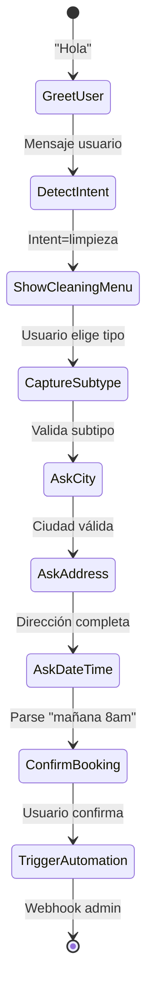
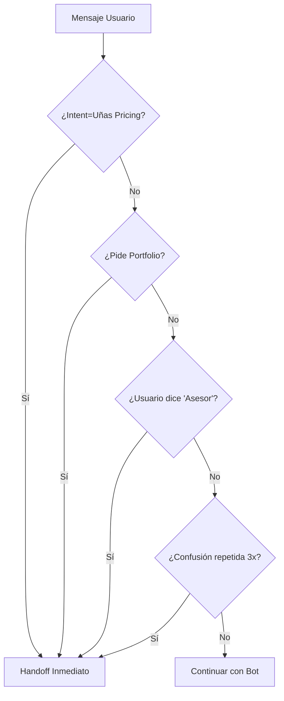

# OMMEO Conversation Flows

## Flujo Principal: Agendamiento de Limpieza

```mermaid
stateDiagram-v2
    [*] --> GreetUser: "Hola"
    GreetUser --> DetectIntent: Mensaje usuario
    DetectIntent --> ShowCleaningMenu: Intent=limpieza
    ShowCleaningMenu --> CaptureSubtype: Usuario elige tipo
    CaptureSubtype --> AskCity: Valida subtipo
    AskCity --> AskAddress: Ciudad válida
    AskAddress --> AskDateTime: Dirección completa
    AskDateTime --> ConfirmBooking: Parse "mañana 8am"
    ConfirmBooking --> TriggerAutomation: Usuario confirma
    TriggerAutomation --> [*]: Webhook admin
```

## Decisión de Handoff

```mermaid
flowchart TD
    A[Mensaje Usuario] --> B{¿Intent=Uñas Pricing?}
    B -->|Sí| C[Handoff Inmediato]
    B -->|No| D{¿Pide Portfolio?}
    D -->|Sí| C
    D -->|No| E{¿Usuario dice 'Asesor'?}
    E -->|Sí| C
    E -->|No| F{¿Confusión repetida 3x?}
    F -->|Sí| C
    F -->|No| G[Continuar con Bot]
```
